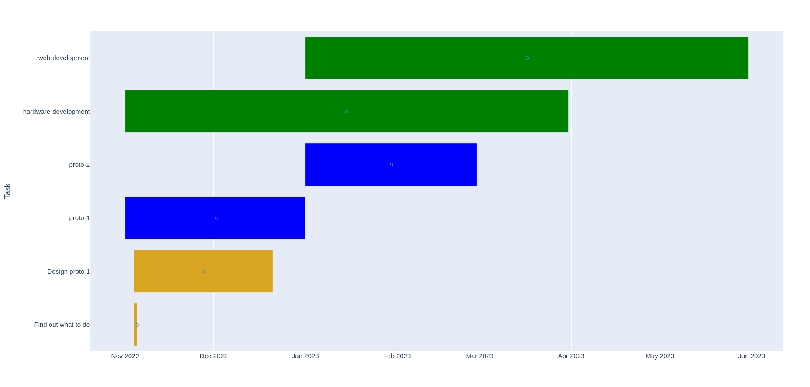

# gitlab-gantt-maker

## Backgruound
Many simpler projects and smaller teams that use Gitlab for source code management do just fine with the Free edition although it lacks some advanced project management features. This project was created out of a need to visualize project timelines, which was the one and only non-free feature needed.

## What it does
The 'gitlab-gantt-maker' script uses the Gitlab API to list milestones and related issues, visualizing them in the form of a Gantt chart. Group milestones are placed on top, considered very high-level timeline items such as project completion. For each project in the group, project timelines are listed next, with their associated issues right under them. Each bar in the Gantt chart has a clickable hyperlink which opens the Gitlab milestone or issue.

## How to use
First install the Python dependencies:
`pip install -r requirements.txt`

Then edit the configuration file `config.ini`.
* Instance is the URL for your Gitlab instance, for projects hosted at Gitlab.com just leave as is.
* Group is the Gitlab group for which you want to generate a Gantt chart. It even works setting the name of a subgroups, at least as long as it has a unique name.
* PersonalAccessToken must be a Gitlab personal access token with API scope. See https://docs.gitlab.com/ee/user/profile/personal_access_tokens.html for information on how to create a token.

Finally the script can be executed with:
`python gitlab-gantt-maker.py`

With no options, `config.ini` will be used as the configuration file and the output will be `gantt.html`. Execute the script with `python gitlab-gantt-maker.py -h` for help on available parameters.
